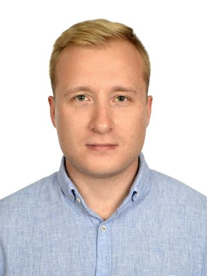

# Vyacheslav Skulkov

## Contact
- Discord: @Ve1okot
- Telegram: @Robin_Cat

## About
I am 32 years old, live in Russia. I want to learn how to create web applications, understand how sites work in order to create good and user-friendly projects. I love my MTB, photography and cats.

## Skills
- HTML
- CSS
- SQL
 
* Photoshop
* Movavi Video Editor
* Figma
* VS Code

## Education
Bachelor of Science: **Automation of Technological Processes** - 2018,
**Moscow Institute of Steel and Alloys**

## Work Exp.
2013-2018 Production worker 
2018-2022 Process Control Engineer

## English А1. Beginner